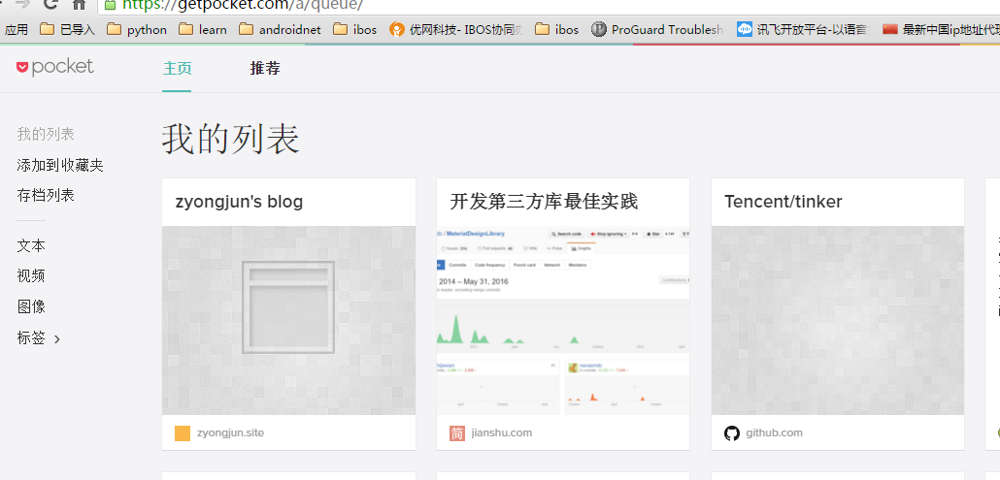

这里分享了些个人日常使用的工具，不敢独享，推荐给大家，后面发现不错的工具会持续更新到这里。 如果在配置和使用上有问题，或者有好用的软件，可以在评论区留言 ，大家一起交流分享。

<!--more-->
#### Sqlite3 数据库GUI工具
##### [SQLite Expert](http://www.sqliteexpert.com)
SQLite Expert 提供两个版本，分别是个人版和专业版。其中个人版是免费的，提供了大多数基本的管理功能。
SQLite Expert 可以让用户管理 SQLite3 数据库并支持在不同数据库间诸如复制、粘贴记录和表；完全支持 Unicode ，编辑器支持皮肤。

#### 文本代码编辑器
##### [Atom](https://atom.io/)

由Github开发，他们使用目前最先进流行的技术重新打造了一款称为“属于21世纪”的代码编辑器——Atom， 它开源免费跨平台，并且整合 GIT 并提供类似 SublimeText 的包管理功能，支持插件扩展，可配置性非常高。

支持各种编程语言的代码高亮(HTML / CSS / Javascript / PHP / Python / C / C++ / Objective C / Java / JSON / Perl / CoffeeScript / Go / Sass / YAML / Markdown 等等)、 与大多数其他编辑器相比，Atom的语言支持已经算是覆盖非常全面了。另外，它的代码补全功能（也叫Snippets） 也非常好用，你只需输入几个字符即可展开成各种常用代码，可以极大提高编程效率。

本人主要用来作Markdown编辑器来写博客。

#### Pocket
Pocket 主要用来保存发现的网站、文本、 视频，大概是笔记的功能，不过非常好的一点是支持离线，界面简洁干净，广告不突兀生硬。

