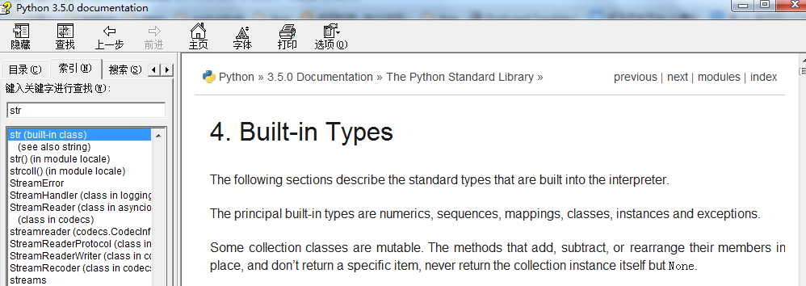

> 关于技术壁垒： 破门而入简单， 翻墙而入艰难，前提是找到门的方向

有的人很短的时间就能熟练的掌握一门语言, 有的人需要在同一条路上来回走上很多遍，才知道真正的方向。   
(+﹏+)不幸的是，我是后一种。 很久以前就开始接触到Python, 光是基础就来来回回折腾了多次，总是感觉不得要领， 后来才渐渐的有点感觉。 在一些论坛上看到很多人提问，这里总结下，希望给还在门外徘徊的兄弟一点建议（一家之言，不一定有什么卵用）
<!--more-->
### 认识新朋友
有过编程学习经验的朋友应该会有这样的感觉，开始学习时候简单的语法都会非常纠结，直到有一天从内心接受，认为本该如此，才能真正的把编程的注意力focus到需求逻辑，而不是语法、方法这些琐碎的问题。
技术快速进步的三大法门：多敲多敲多敲（<-_<-废话都是真理）
#### 保持联系
> 真正的爱情不是片刻的激情，是持久的细水长流的坚持。

保持专注，不要奢求一次掌握所有细节，记住能记住的。掌握如何使用一个没接触过的知识点是开始学习必须掌握的。
#### 查找文档

不管有多不适，学习Python总要和它打交道，最全面最权威的资料就在这里，略读拿走你需要的

#### IDLE 随时解决疑惑
Python安装后自带IDLE， IDLE在编码过程中查询类方法的用法，测试非常方便

常用快捷键：
- Tab 自动补全
- Alt+N Alt+P 可以查找以前输入的命令
- Ctrl+方向键
- F5 执行程序

常用内建方法：
- dir 查询对象的内部属性和方法
- help 查询对象的具体用法
- __doc__  查询对象使用文档

### 练习
入门阶段可以找一些视频或者教程来辅助学习， 个人推荐：
- [廖雪峰python3教程](http://www.liaoxuefeng.com/wiki/0014316089557264a6b348958f449949df42a6d3a2e542c000/)
- [零基础入门Python](http://bbs.fishc.com/forum-243-1.html)

课后习题一定要独立完成， 即便不会也要思考后再看答案。

### 学以致用
平时工作或者一些想法， 可以尝试使用脚本实现，通过查资料、学习新知识来完成，量变到质变。

### 沉浸学习环境
> 即便是常年专业写代码的人，一段时间不写也会生疏

个人建议注册一到两个比较活跃的Python社区、论坛，放空的时候可以去逛逛，遇到感兴趣的帖子驻足研究下，水滴石穿。
只要前行，终达彼岸。
推荐：
- [鱼C论坛](http://bbs.fishc.com/forum.php)
- [Python中文开发者社区](http://www.pythontab.com/)
另外可以关注一些适合自己水平的优质博客。

以上，祝编程愉快 :)
感谢阅读此文章，如果此文章对你有用或者你有任何疑问和意见，请在下方留言或者在[github](https://github.com/zyongjun)上fork我,你的鼓励对我有非凡的意义。
